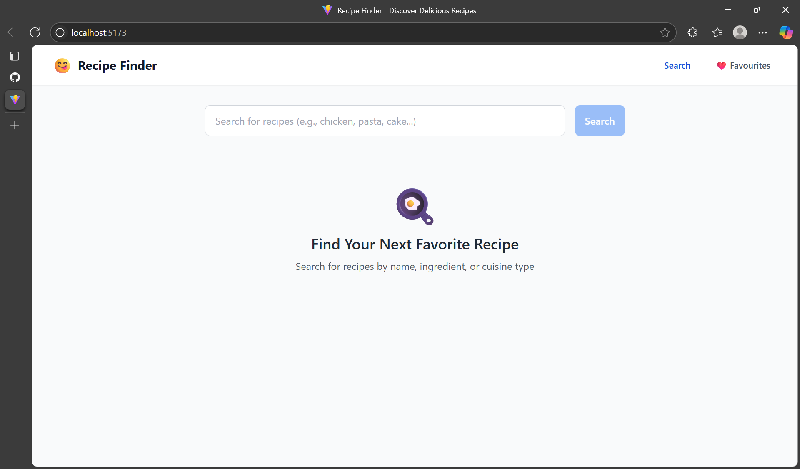
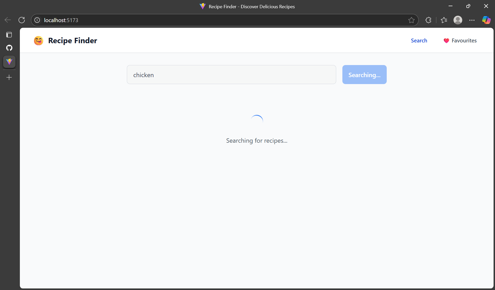
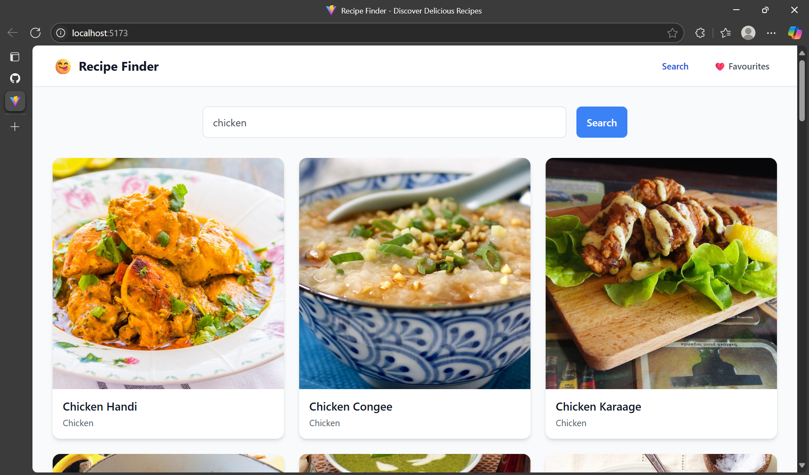
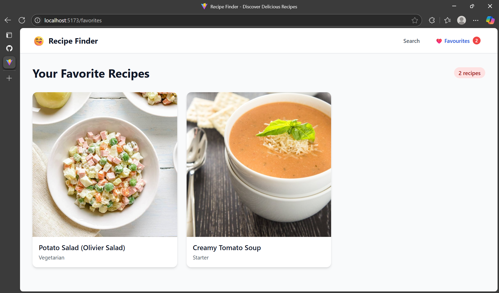
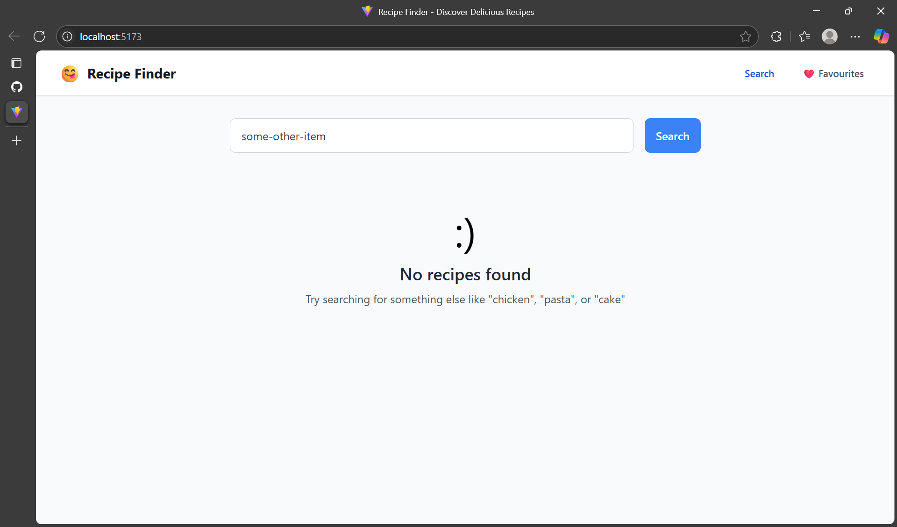

# Recipe Finder React

A  a beautiful and functional web application where users can search for recipes, view details, and save their favorites.

## Features

- **Ingredient Search:** Enter ingredients and get recipe suggestions instantly.
- **Recipe Details:** View cooking instructions, ingredients list, and nutritional info.\
- **Favorites:** Save and manage your favorite recipes.
- **API Integration:** Fetches real-time recipes from a third-party API.
- **Error Handling:** Messages for failed searches or API errors.

### home page with search button disabled


### request throttling


### search results


### favourite items


### default page for wrong search



## Getting Started
### Prerequisites

- Node.js 
- npm (v6 or later) 

### Installation

1. **Clone the repository:**
   ```bash
   git clone https://github.com/pandeyshivam-debug/recipe-finder-react.git
   cd recipe-finder-react
   ```

2. **Install dependencies:**
   ```bash
   npm install
   ```

3. **Start the development server:**
   ```bash
   npm run dev
   ```

4. Open [http://localhost:3000](http://localhost:3000) to view it in the browser.

## Project Structure

```
recipe-finder-react/
├── screenshots/
├── src/
│   ├── components/
│   ├── context/
│   ├── pages/
│   ├── utils/
│   └── App.jsx
│   └── index.css
│   └── main.jsx
├── .gitignore
├── index.html
├── README.md
├── package.json
└── ...
```
